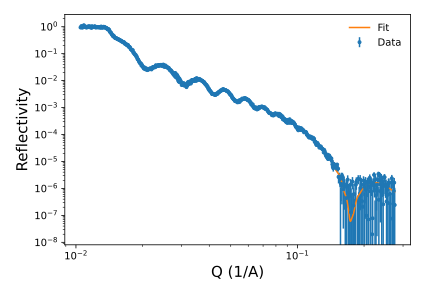
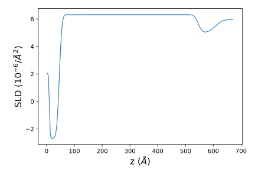
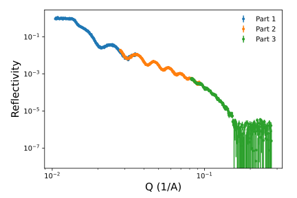

# Report for Set ID: 218281

## Fit results for cu_thf
**Assessment run on**: 2025-07-12 13:09:27

### ✅ Fit Quality
**Final Chi-squared**: 2.208(19) - Good fit quality

### 📊 Fitted Parameters with Uncertainties

| Layer | Parameter | Fitted Value | Uncertainty | Min | Max | Units |
|-------|-----------|--------------|-------------|-----|-----|-------|
| **Beam** | intensity | 0.9558 | ±0.0029 | 0.95 | 1.05 | - |
| **THF** | interface | 20.90 | ±0.69 | 1.0 | 25.0 | Å |
| **THF** | rho | 5.97 | ±0.01 | 4.5 | 6.4 | ×10⁻⁶ Å⁻² |
| **material** | interface | 11.14 | ±0.41 | 1.0 | 33.0 | Å |
| **material** | rho | 5.00 | ±0.00 | 5.0 | 12.0 | ×10⁻⁶ Å⁻² |
| **material** | thickness | 62.08 | ±0.66 | 10.0 | 200.0 | Å |
| **Cu** | interface | 7.35 | ±0.29 | 1.0 | 12.0 | Å |
| **Cu** | rho | 6.31 | ±0.00 | 2.0 | 12.0 | ×10⁻⁶ Å⁻² |
| **Cu** | thickness | 500.10 | ±0.31 | 400.0 | 1000.0 | Å |
| **Ti** | interface | 2.06 | ±0.53 | 1.0 | 22.0 | Å |
| **Ti** | rho | -2.69 | ±0.05 | -3.0 | -1.0 | ×10⁻⁶ Å⁻² |
| **Ti** | thickness | 35.78 | ±0.18 | 30.0 | 60.0 | Å |

### 📁 File Locations
**Fit data location**: `/tmp/fits/218281_cu_thf`

### 📈 Generated Plots

### 📝 Analysis Notes
- Fit converged successfully with 12 parameters
- Parameter uncertainties calculated from MCMC sampling
- Parameter ranges show fitting constraints used during optimization
- All parameters appear within reasonable physical ranges

## Partial Data Assessment
Assessment run on: 2025-07-06 12:38:27

### Overlap Metrics (Chi-squared)

- Overlap 1: 2.9930
- Overlap 2: 1.4095
